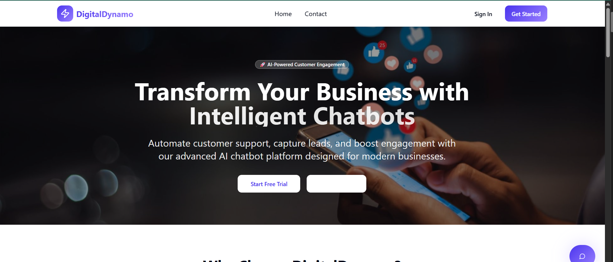
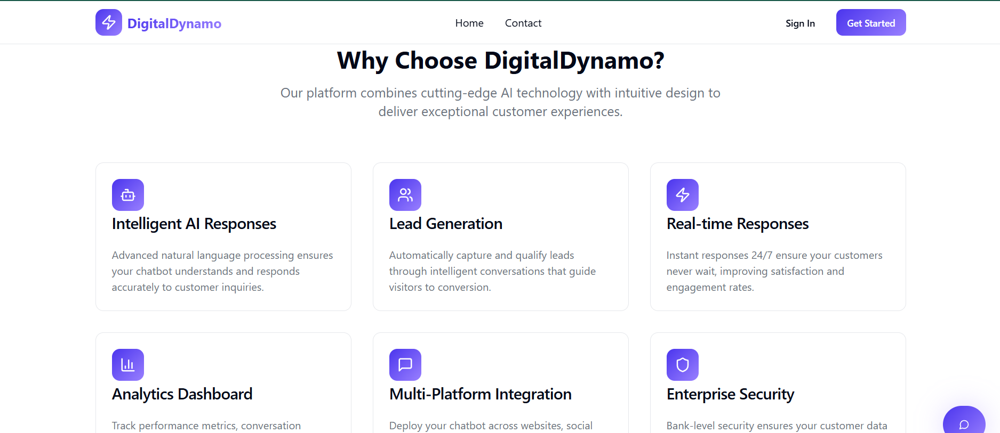
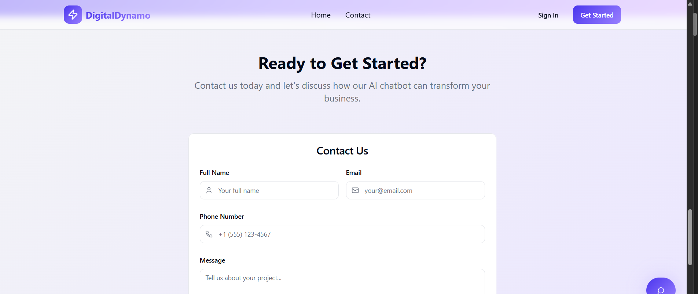
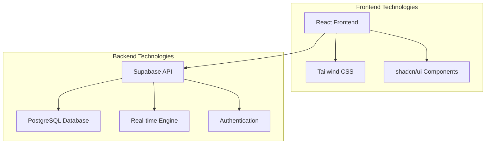

# DigitalDynamo - AI-Powered Chatbot Platform

<div align="center">
  
  
  <p align="center">
    <strong>Transform your business with intelligent chatbots designed for modern customer engagement</strong>
  </p>
  
  <p align="center">
    <a href="https://lovable.dev/projects/67c1984d-b869-4c60-85bc-1d42da3bb7dd">🚀 Live Demo</a> •
    <a href="#-features">Features</a> •
    <a href="#-installation">Installation</a> •
    <a href="#-documentation">Documentation</a> •
    <a href="#-contributing">Contributing</a>
  </p>
  
  <p align="center">
    
    
    
    
    
  </p>
</div>

---

## 📋 Table of Contents
- [🌟 Overview](#-overview)
- [✨ Features](#-features)  
- [🚀 Live Demo](#-live-demo)
- [📸 Screenshots](#-screenshots)
- [🛠️ Technology Stack](#️-technology-stack)
- [⚡ Installation](#-installation)
- [🔧 Configuration](#-configuration)
- [🚀 Deployment](#-deployment)
- [📚 Documentation](#-documentation)
- [🤝 Contributing](#-contributing)
- [🔒 Security](#-security)
- [📈 Analytics](#-analytics)
- [📞 Support](#-support)
- [📄 License](#-license)

## 🌟 Overview

DigitalDynamo is a cutting-edge AI-powered chatbot platform designed to revolutionize customer engagement and lead generation. Built with modern web technologies, it provides businesses with intelligent, real-time customer support capabilities while maintaining enterprise-grade security and scalability.

## 🚀 Live Demo

🌐 **[View Live Application](https://lovable.dev/projects/67c1984d-b869-4c60-85bc-1d42da3bb7dd)**

Experience DigitalDynamo in action! The live demo showcases all features including AI-powered chatbots, lead generation, and real-time analytics.

## 📸 Screenshots

<div align="center">

### 🏠 Hero Section - Landing Page

<p><em>Engaging hero section with AI-powered customer engagement visualization</em></p>

### ✨ Features Section - Platform Capabilities  

<p><em>Comprehensive feature showcase highlighting AI responses, lead generation, and analytics</em></p>

### 📞 Contact Section - Customer Engagement

<p><em>Professional contact form with integrated chatbot for immediate assistance</em></p>

### 📊 Dashboard Overview

<p><em>Modern analytics dashboard with real-time metrics and insights</em></p>

</div>

<details>
<summary>🖼️ Technical Features</summary>

### Key Platform Highlights
- **📱 Mobile Responsive**: Perfect viewing on all devices (phones, tablets, desktop)
- **🎨 Modern UI/UX**: Clean, professional design with intuitive navigation
- **⚡ Real-time Chat**: Instant messaging capabilities with AI responses
- **📊 Analytics Dashboard**: Comprehensive reporting and monitoring tools
- **🔒 Enterprise Security**: Bank-level security with role-based access
- **🌐 Multi-platform**: Works across web, mobile, and integration platforms

</details>

## ✨ Features

<table>
<tr>
<td width="50%">

### 🤖 **AI-Powered Intelligence**
- Advanced natural language processing
- Context-aware conversations
- Multi-language support
- Smart response suggestions

### 📊 **Analytics & Insights**
- Real-time conversation metrics
- Lead conversion tracking
- User engagement analytics
- Performance monitoring dashboard

</td>
<td width="50%">

### 🚀 **Lead Generation**
- Automated lead capture
- Intelligent lead qualification
- CRM integration ready
- Custom lead scoring

### 🔒 **Enterprise Security**
- Bank-level encryption
- GDPR compliance
- Role-based access control
- Audit logging

</td>
</tr>
</table>

### 🌟 **Key Capabilities**
- ⚡ **Real-time Responses** - 24/7 instant customer support
- 🌐 **Multi-Platform Integration** - Deploy across websites, social media, and messaging platforms
- 📱 **Mobile Responsive** - Optimized for all devices and screen sizes
- 🎨 **Customizable UI** - Brand-aligned design and theming options
- 📈 **Scalable Architecture** - Built to handle enterprise-level traffic

## 🛠️ Technology Stack

<div align="center">

| Category | Technologies |
|----------|-------------|
| **Frontend Framework** |   |
| **Build Tool** |  |
| **Styling** |   |
| **Backend** |   |
| **Authentication** |  |
| **Real-time** |  |
| **State Management** |  |
| **Form Handling** |   |
| **Icons** |  |
| **Notifications** |  |

</div>

### 🏗️ **Architecture Overview**



### 📦 **Core Dependencies**

<details>
<summary>View Complete Package List</summary>

#### Frontend Core
- `react: ^18.3.1` - Modern React with hooks and concurrent features
- `react-dom: ^18.3.1` - React DOM renderer
- `typescript: ^5.0+` - Type-safe JavaScript development
- `vite: ^5.0+` - Next-generation frontend tooling

#### UI & Styling
- `tailwindcss: ^3.4+` - Utility-first CSS framework
- `@radix-ui/*` - Unstyled, accessible UI primitives
- `class-variance-authority: ^0.7.1` - CVA for component variants
- `tailwind-merge: ^2.6.0` - Merge Tailwind classes efficiently

#### Data Management
- `@supabase/supabase-js: ^2.55.0` - Supabase JavaScript client
- `@tanstack/react-query: ^5.83.0` - Data fetching and caching
- `react-hook-form: ^7.61.1` - Performant forms library
- `zod: ^3.25.76` - TypeScript-first schema validation

#### Utilities
- `lucide-react: ^0.462.0` - Beautiful & consistent icons
- `sonner: ^1.7.4` - Toast notifications
- `date-fns: ^3.6.0` - Modern JavaScript date utility library
- `clsx: ^2.1.1` - Utility for constructing className strings

</details>

## 📊 Database Schema

### Core Tables
- **profiles** - User profile information
- **leads** - Captured lead data from chatbot interactions
- **chat_messages** - Real-time chat message storage

## ⚡ Installation

### 📋 Prerequisites

Before you begin, ensure you have the following installed:

- **Node.js** (18+ recommended) - [Download here](https://nodejs.org/)
- **npm** or **yarn** package manager
- **Git** for version control
- **Supabase account** for backend services - [Sign up here](https://supabase.com/)

### 🚀 Quick Start

1. **Clone the repository**
   ```bash
   git clone https://github.com/yourusername/digitaldynamo.git
   cd digitaldynamo
   ```

2. **Install dependencies**
   ```bash
   # Using npm
   npm install
   
   # Or using yarn
   yarn install
   ```

3. **Start development server**
   ```bash
   npm run dev
   ```

4. **Open your browser**
   ```
   http://localhost:5173
   ```

### 🔧 Configuration

#### Environment Variables
This project uses Supabase for backend services. The configuration is automatically handled through Lovable's integration.

For local development with custom Supabase instance:

```bash
# Create .env.local file
VITE_SUPABASE_URL=your_supabase_url
VITE_SUPABASE_ANON_KEY=your_supabase_anon_key
```

#### Supabase Setup
1. Create a new project in [Supabase Dashboard](https://supabase.com/dashboard)
2. Run the database migrations (automatically handled in Lovable)
3. Configure authentication providers if needed
4. Set up Row Level Security policies

### 📦 Available Scripts

```bash
npm run dev          # Start development server
npm run build        # Build for production  
npm run preview      # Preview production build
npm run lint         # Run ESLint
npm run type-check   # Run TypeScript compiler
```

## 🌐 Deployment

### Quick Deploy with Lovable
1. Open your [Project](https://lovable.dev/projects/67c1984d-b869-4c60-85bc-1d42da3bb7dd)
2. Click **Publish** in the top-right corner
3. Your app will be deployed with a lovable.app domain

### Custom Domain
To connect your own domain:
1. Navigate to Project > Settings > Domains
2. Click "Connect Domain"
3. Follow the DNS configuration steps

### Self-Hosting Options
The codebase is standard React/Vite and can be deployed to:
- Vercel
- Netlify  
- AWS Amplify
- Any static hosting service

## 🔧 Development

### Project Structure
```
src/
├── components/          # Reusable UI components
│   ├── ui/             # shadcn/ui components
│   ├── Navbar.tsx      # Navigation component
│   ├── Footer.tsx      # Footer component
│   └── Chatbot.tsx     # Main chatbot interface
├── pages/              # Route components
│   ├── Home.tsx        # Landing page
│   ├── Dashboard.tsx   # User dashboard
│   └── Auth.tsx        # Authentication page
├── hooks/              # Custom React hooks
├── lib/                # Utility functions
└── integrations/       # Supabase integration
```

### Available Scripts
```bash
npm run dev          # Start development server
npm run build        # Build for production
npm run preview      # Preview production build
npm run lint         # Run ESLint
```

## 🔒 Security Features

- Row Level Security (RLS) policies on all database tables
- User authentication and authorization
- Secure API endpoints through Supabase Edge Functions
- Data encryption in transit and at rest

## 📈 Analytics & Monitoring

The platform includes built-in analytics for:
- Chat conversation metrics
- Lead conversion tracking
- User engagement analytics
- Performance monitoring

## 📚 Documentation

### 📖 **Official Documentation**
- [**Lovable Documentation**](https://docs.lovable.dev/) - Complete platform guide
- [**Supabase Documentation**](https://supabase.com/docs) - Backend services guide
- [**React Documentation**](https://react.dev/) - Frontend framework guide
- [**Tailwind CSS Documentation**](https://tailwindcss.com/docs) - Styling framework guide

### 🎥 **Video Tutorials**
- [**Getting Started with Lovable**](https://www.youtube.com/watch?v=9KHLTZaJcR8&list=PLbVHz4urQBZkJiAWdG8HWoJTdgEysigIO) - YouTube playlist
- [**Building Fullstack Apps**](https://docs.lovable.dev/user-guides/quickstart) - Step-by-step guide

### 📋 **API Reference**
- [**Supabase API**](https://supabase.com/docs/reference/javascript/introduction) - Backend API reference
- [**shadcn/ui Components**](https://ui.shadcn.com/) - UI component library

## 🤝 Contributing

We welcome contributions from the community! This project is built with [Lovable](https://lovable.dev), an AI-powered development platform.

### 🚀 **Quick Contribution Guide**

1. **Fork the repository**
   ```bash
   git fork https://github.com/yourusername/digitaldynamo
   ```

2. **Create a feature branch**
   ```bash
   git checkout -b feature/amazing-feature
   ```

3. **Make your changes**
   - Follow our [coding standards](#-development-guidelines)
   - Write tests for new features
   - Ensure responsive design

4. **Commit your changes**
   ```bash
   git commit -m 'feat: Add amazing feature'
   ```

5. **Push and create PR**
   ```bash
   git push origin feature/amazing-feature
   ```

### 📝 **Development Guidelines**
- **Code Style**: TypeScript with ESLint configuration
- **Testing**: Comprehensive testing for new features
- **Documentation**: Update docs for significant changes
- **Accessibility**: Follow WCAG guidelines
- **Security**: Implement proper security measures

### 🛠️ **Development Methods**
- **Via Lovable**: Use the AI chat interface for guided development
- **Local Development**: Clone repo, make changes, and push to GitHub
- **Visual Edits**: Use Lovable's Visual Edits feature for quick UI changes

For detailed contribution guidelines, see [CONTRIBUTING.md](CONTRIBUTING.md).

## 🔒 Security

### 🛡️ **Security Features**
- **Row Level Security (RLS)** - Database-level security policies
- **Authentication & Authorization** - Secure user management
- **Data Encryption** - In transit and at rest
- **HTTPS Enforcement** - Secure communication
- **Input Validation** - Prevent injection attacks

### 🔍 **Security Reporting**
If you discover a security vulnerability, please email us at [security@digitaldynamo.com](mailto:security@digitaldynamo.com). We take security seriously and will respond promptly.

## 📈 Analytics

### 📊 **Built-in Analytics**
The platform includes comprehensive analytics for:
- **Conversation Metrics** - Track chat interactions and response times
- **Lead Conversion** - Monitor lead generation and qualification rates
- **User Engagement** - Analyze user behavior and retention
- **Performance Monitoring** - System health and uptime tracking

### 📈 **Key Performance Indicators**
- Customer satisfaction rates
- Response time metrics
- Lead conversion funnel
- User engagement scores

## 📞 Support

### 🆘 **Get Help**

<table>
<tr>
<td width="50%">

#### 💬 **Community Support**
- [**Discord Community**](https://discord.com/channels/1119885301872070706/1280461670979993613)
- [**GitHub Issues**](https://github.com/yourusername/digitaldynamo/issues)
- [**Discussions**](https://github.com/yourusername/digitaldynamo/discussions)

</td>
<td width="50%">

#### 🏢 **Enterprise Support**
- **Email**: [support@digitaldynamo.com](mailto:support@digitaldynamo.com)
- **Documentation**: [docs.lovable.dev](https://docs.lovable.dev)
- **Live Chat**: Use the in-app chatbot

</td>
</tr>
</table>

### 📧 **Contact Information**
- **General Inquiries**: [hello@digitaldynamo.com](mailto:hello@digitaldynamo.com)
- **Technical Support**: [support@digitaldynamo.com](mailto:support@digitaldynamo.com)
- **Business Inquiries**: [business@digitaldynamo.com](mailto:business@digitaldynamo.com)

## 📄 License

This project is licensed under the **MIT License** - see the [LICENSE](LICENSE) file for details.

### 📋 **License Summary**
- ✅ **Commercial use** - Use for commercial projects
- ✅ **Modification** - Modify the source code
- ✅ **Distribution** - Distribute copies of the software
- ✅ **Private use** - Use for private projects
- ❌ **Liability** - Authors not liable for damages
- ❌ **Warranty** - No warranty provided

---

<div align="center">

## 🌟 **Ready to Transform Your Customer Experience?**

<p>
  <a href="https://lovable.dev/projects/67c1984d-b869-4c60-85bc-1d42da3bb7dd">
    
  </a>
  <a href="mailto:demo@digitaldynamo.com">
    
  </a>
</p>

</div>
